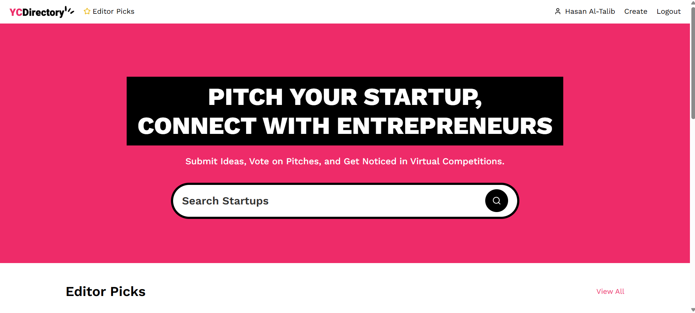

# 🚀 StartupHub: Connect, Pitch, and Grow

https://github.com/HasanAmmar05/Startup-Hub/main/Yc-Directory-Pitch.mp4

## 🌟 Overview

StartupHub is a dynamic platform where entrepreneurs can showcase their startups, connect with like-minded innovators, and get discovered by potential investors. Built with Next.js 14, Sanity CMS, and TypeScript, this full-stack application offers a seamless experience for startup founders to pitch their ideas and gain visibility.

## ✨ Features

### For Entrepreneurs

- **🎯 Startup Showcase**: Create detailed profiles for your startups with descriptions, pitches, and images
- **📊 Analytics**: Track views and engagement with your startup listings
- **🔍 Discoverability**: Get featured in Editor Picks for maximum visibility

### For Users

- **🔐 Secure Authentication**: Sign in with GitHub for a seamless experience
- **👥 User Profiles**: Personalized profiles showcasing your startups and contributions
- **🔎 Search & Filter**: Easily discover startups by category or keyword

### Platform Features

- **✏️ Rich Content Editing**: Markdown support for detailed startup pitches
- **🌓 Dark/Light Mode**: Comfortable browsing experience in any lighting
- **📱 Responsive Design**: Perfect experience across all devices
- **⚡ Real-time Updates**: See new startups and changes instantly

## 🛠️ Tech Stack

- **Frontend**: Next.js 15, React, TypeScript, Tailwind CSS
- **Backend**: Next.js API Routes, Sanity CMS
- **Authentication**: NextAuth.js with GitHub provider
- **Styling**: Tailwind CSS, Shadcn UI components
- **Deployment**: Vercel
- **Monitoring**: Sentry for error tracking

## 📸 Screenshots

<div style="display: flex; gap: 10px; flex-wrap: wrap;">
  
  
</div>

## 🚀 Getting Started

### Prerequisites

- Node.js 18+ and npm
- GitHub account for authentication
- Sanity account for CMS

### Installation

1. Clone the repository

```bash
git clone https://github.com/yourusername/startuphub.git
cd startuphub
```

2. Install dependencies

```bash
npm install
```

3. Set up environment variables
   Create a `.env.local` file with the following variables:

```
# Authentication
AUTH_SECRET="your-auth-secret"
AUTH_GITHUB_ID="your-github-client-id"
AUTH_GITHUB_SECRET="your-github-client-secret"

# Sanity CMS
NEXT_PUBLIC_SANITY_PROJECT_ID="your-sanity-project-id"
NEXT_PUBLIC_SANITY_DATASET="your-sanity-dataset"
NEXT_PUBLIC_SANITY_API_VERSION="vX"
SANITY_WRITE_TOKEN="your-sanity-write-token"
```

4. Run the development server

```bash
npm run dev
```

5. Open [http://localhost:3000](http://localhost:3000) in your browser

## 🏗️ Project Structure

```
startuphub/
├── app/                  # Next.js app directory
│   ├── (root)/           # Main application routes
│   ├── api/              # API routes
│   └── globals.css       # Global styles
├── components/           # Reusable UI components
├── lib/                  # Utility functions and actions
├── public/               # Static assets
├── sanity/              # Sanity CMS configuration
│   ├── lib/             # Sanity client utilities
│   ├── schemas/         # Content schemas
│   └── types.ts         # TypeScript types for Sanity
└── styles/              # Additional styling
```

## 🧩 Key Components

- **StartupCard**: Displays startup information in a card format
- **StartupForm**: Allows users to create and edit startup listings
- **AuthorImage**: Handles user profile images with fallbacks
- **UserStartups**: Shows startups created by a specific user
- **SearchForm**: Enables searching across the platform

## 🔄 Workflow

1. **User Authentication**: Sign in with GitHub
2. **Create a Startup**: Fill out the startup form with details and pitch
3. **Browse Startups**: Discover startups on the homepage or through search
4. **View Details**: Click on a startup card to see full details
5. **Connect**: Visit user profiles to see all their startups

## 🤝 Contributing

Contributions are welcome! Please feel free to submit a Pull Request.

1. Fork the repository
2. Create your feature branch (`git checkout -b feature/amazing-feature`)
3. Commit your changes (`git commit -m 'Add some amazing feature'`)
4. Push to the branch (`git push origin feature/amazing-feature`)
5. Open a Pull Request


## 🙏 Acknowledgements

- [Next.js](https://nextjs.org/) for the amazing React framework
- [Sanity](https://www.sanity.io/) for the flexible content management
- [Tailwind CSS](https://tailwindcss.com/) for the utility-first CSS
- [Shadcn UI](https://ui.shadcn.com/) for beautiful UI components
- [Vercel](https://vercel.com/) for hosting and deployment
- [Sentry](https://sentry.io/) for error monitoring

---

Built By Hasan

